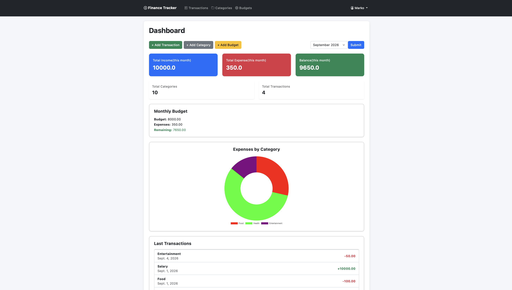
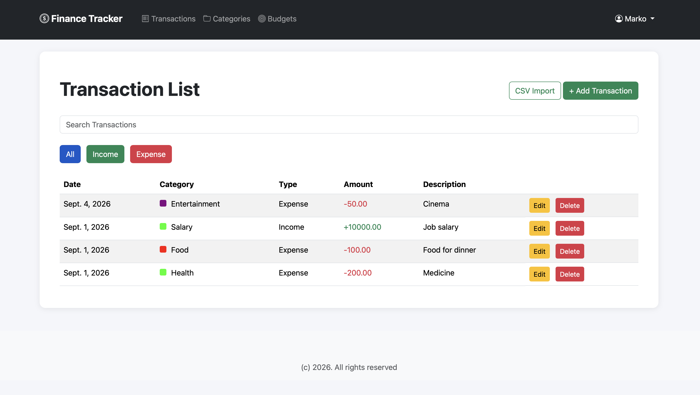
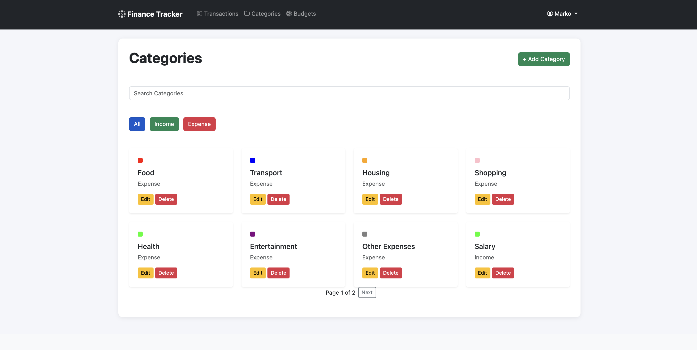
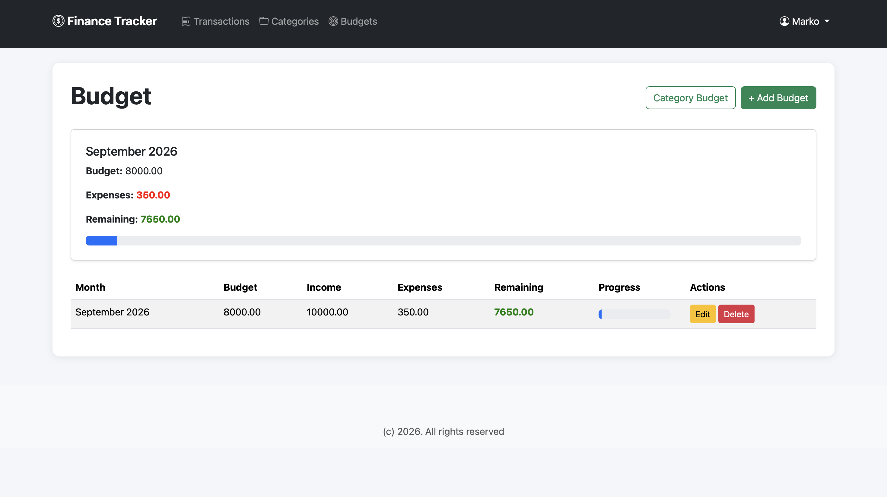
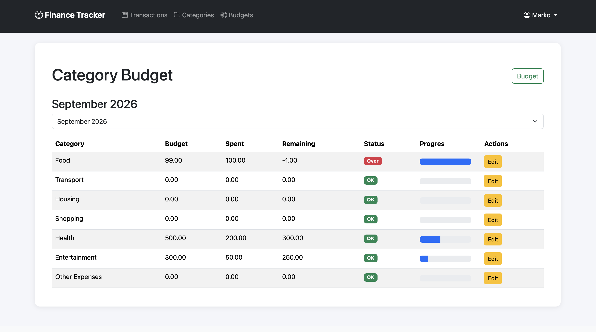

# Finance Tracker

Finance Tracker is a web application for managing personal finances built with Django.

I created this project to practice backend development with Django, working with databases, authentication, forms, REST APIs and deployment.

## Features

- User registration, login and logout
- Add, edit and delete transactions
- Income and expense categories
- Default categories for new users
- Create custom categories
- Search and filter transactions
- Filter transactions by month
- Monthly budgets
- Budgets for individual expense categories
- Dashboard with income, expenses and balance
- Expense statistics by category
- Recent transactions
- CSV transaction import
- Basic REST API for transactions

## Technologies

### Backend

- Python
- Django 5
- Django REST Framework
- Django ORM

### Frontend

- HTML
- CSS
- Bootstrap
- JavaScript
- Chart.js

### Database

- PostgreSQL in production
- SQLite for local development

### Deployment

- Railway
- Gunicorn

## Live Demo

The project is deployed on Railway:

https://finance-tracker-production-7405.up.railway.app

## Screenshots

### Dashboard


### Transactions


### Categories


### Budgets




## Run Locally

Clone the repository:

```bash
git clone https://github.com/markoshevtsiv/finance-tracker.git
cd finance-tracker
```

Create a virtual environment:

```bash
python -m venv venv
```

Activate the virtual environment.

macOS / Linux:

```bash
source venv/bin/activate
```

Windows:

```bash
venv\Scripts\activate
```

Install dependencies:

```bash
pip install -r requirements.txt
```

Create a `.env` file in the root directory:

```env
DJANGO_SECRET_KEY=your-secret-key
```

Apply database migrations:

```bash
python manage.py migrate
```

Run the development server:

```bash
python manage.py runserver
```

Open the application in your browser:

```text
http://127.0.0.1:8000/
```

## CSV Import

Transactions can also be imported from a CSV file.

The application can create categories from the imported data and add the transactions to the current user's account.

## API

The project includes a basic REST API for working with transactions using Django REST Framework.

## Project Structure

```text
finance-tracker/
├── finance_tracker/     # Django project settings
├── tracker/             # Main application
├── templates/           # HTML templates
├── static/              # CSS and static files
├── manage.py
└── requirements.txt
```

## Future Improvements

- Automated tests
- Docker support
- Better API documentation
- More detailed financial analytics
- Recurring transactions
- CSV export

## Author

Marko Shevtsiv